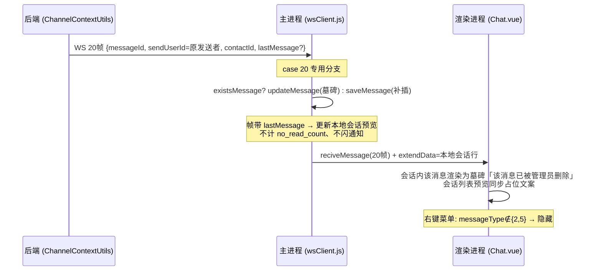

# Design — 管理端消息删除位

- 关联 Proposal: 2026-09-29-admin-message-delete/proposal.md
- 创建日期: 2026-09-29

## 1. 架构设计

删除动作唯一入口为既有举报处置 `dealReport`（`checkAdmin`），业务归位消息域：

```
AdminReportServiceImpl.dealReport (reportType=3, handleAction=DELETE_CONTENT)
   └─> ChatMessageService.adminDeleteMessage(messageId, admin)
         ├─ selectByMessageId 读原文（PK 读，不进 query_condition）
         ├─ 已删 → 幂等返回（不改写不重推）
         ├─ UPDATE chat_message SET delete_flag=<now>        （事务内）
         ├─ 若为会话最新消息 → chat_session / chat_session_user 预览置占位（事务内）
         └─ MessageHandler.sendMessage(20帧)                  （事务后，仿 recall 先 update 后 push）
               └─ ChannelContextUtils
                    ├─ 单聊: send2User → applyContactConvert(20∈白名单)
                    │        ├─ 在线 → 直推接收方
                    │        ├─ 接收方离线 → Redis 离线缓冲（重连 replay 补推 ✓）
                    │        └─ 发送方副本: sendRecallToSenderDevices(条件扩为14|20)
                    │              ├─ 在线 → 转换前直投（既有）
                    │              └─ 离线(仅20) → 入发送方离线缓冲【本期增强】
                    │                    └─ replay: sendUserId=收件人本人 → 跳过转换【增强规则①】
                    └─ 群聊: sendMsg2Group → 在线成员直推
                          └─ 离线成员 → 逐成员 pushOfflineMessage【本期增强】
                                └─ replay: contactType=1 群帧跳过转换【增强规则②，防脏会话】
```

### 三层交互时序图（后端 / 主进程 wsClient / 渲染进程）



### 后端改动

| 模块 | 改动 | 职责边界 |
|------|------|----------|
| Controller | 无改动（`dealReport`/`recallMessage`/`downloadFile`/`locateMessage` 路由不变） | — |
| Service | `ChatMessageService` 新增 `adminDeleteMessage`；`recallMessage/downloadFile/locateMessage` 增已删守卫；`AdminReportServiceImpl` DELETE_CONTENT 分支接线 + `selectMessage` 切 `selectByMessageId` + 注入 `ChatMessageService` | 事务边界（置位+预览改写）、幂等、帧推送时机 |
| Mapper / SQL | `ChatMessageMapper.xml`：`query_condition` 加 `AND delete_flag = 0`、`base_column_list`/`resultMap` 补列、`updateByMessageId` 加置位分支；`ChatSessionMapper` 预览占位更新 | 只写 SQL；过滤条件无 `<if>` 开关（不可绑定绕过） |
| Entity | `ChatMessage` 补 `deleteFlag`；`MessageTypeEnum` 新增 `20 ADMIN_DELETE` | 持久化对象 1:1 表结构 |

### 前端改动

| 模块 | 改动 | 职责边界 |
|------|------|----------|
| 主进程 | `wsClient.js` 新增 `case 20` 分支（墓碑化 + 条件预览更新 + `reciveMessage` 转发） | 本地 DB 经 Model 层，不写 SQL |
| preload | 无改动 | — |
| 渲染进程 | `Chat.vue` 20 帧会话内处理；`ChatMessage.vue` 墓碑渲染；`ReportList.vue` 处置提示文案 | 不直接访问 Node.js API |

## 2. 接口设计

无新端点。行为变化：

| 端点 | 变化 | 权限 |
|------|------|------|
| `POST /admin/report/dealReport` | `reportType=3` + `handleAction=1` 由「appendNote 仅记录」→ 真实逻辑删除 + 推 20 帧；重复处置已删消息幂等（不报错不重推） | checkAdmin（既有） |
| `POST /chat/recallMessage` | 已删消息 → `CODE_2201`（守卫加在既有 4 段校验之前） | 登录（既有） |
| `POST /chat/downloadFile` | 已删消息 → `CODE_2201` | 登录（既有） |
| `POST /chat/locateMessage` | 已删消息 → `CODE_2201` | 登录（既有） |

### 错误码

无新增，复用既有分段：`2201 消息不存在`（已删消息对用户即不存在）；`2702/2703` 举报处置语义不变。

### 20 帧结构（`MessageSendDto`）

| 字段 | 取值 | 说明 |
|------|------|------|
| messageType | `20` | `MessageTypeEnum.ADMIN_DELETE(20, "", "管理员删除消息")` |
| messageId | 原消息 messageId | 客户端按此定位本地行 |
| sessionId / contactId / contactType | 原消息值 | `contactId` 经 `applyContactConvert` 置为 `sendUserId`（接收方视角联系人=原发送者） |
| sendUserId / sendUserNickName | **原消息发送者**（非操作管理员） | 保持「联系人=原发送者」转换语义与发送方副本投递正确 |
| messageContent | `"该消息已被管理员删除"` | 墓碑固定文案 |
| sendTime | 处置时刻 ms | — |
| lastMessage | 仅当被删消息为会话最新时携带占位文案，否则 null | 见 ADR-004，防预览被错误覆盖 |

## 3. 数据模型

| 表 | 变更 | 字段 | 类型 | 说明 |
|----|------|------|------|------|
| `chat_message` | 新增字段 | `delete_flag` | `BIGINT NOT NULL DEFAULT 0` | 0=存活，非0=删除时间戳ms |

```sql
-- easychat-migration-009-message-delete.sql
ALTER TABLE `chat_message`
  ADD COLUMN `delete_flag` BIGINT NOT NULL DEFAULT 0 COMMENT '0=存活，非0=删除时间戳ms';
```

- 同步 `easychat.sql` 基线（列定义 + 注释）
- 不加索引：`delete_flag` 低选择性，查询总是与 `session_id`/`send_time` 联合过滤
- MySQL 5.7 加列 = INPLACE（需重建表），`chat_message` 为最大表，建议低峰执行

## 4. 安全设计

- 鉴权: 删除动作唯一入口 `dealReport` 带 `checkAdmin=true`；无面向普通用户的删除端点
- 数据权限: 用户只能看到自己会话内消息；已删消息对所有用户不可见，管理端仅用于证据的读取点（`selectByMessageId`、`ReportReadMapper` 摘要 JOIN）保留原文
- 输入校验: 无新增入参；`delete_flag` 不存在于任何 Query 类字段 → **HTTP 层无法构造绕过过滤的查询**
- SQL 注入防护: 新增条件全部 `#{}` / 字面量；`query_condition` 过滤为无条件文本，无 `${}`

## 5. ADR

### ADR-001: `delete_flag BIGINT` 时间戳语义（0=存活，非0=删除时间）

- 状态: 已接受（2026-09-29 人工拍板）
- 上下文: `chat_message.status` 已被发送态占用（0发送中/1已发送…），须新列；逻辑删除位需与既有先例一致
- 决策: 对齐 `sensitive_word.delete_flag`（BIGINT 0/时间戳ms）
- 后果: 正面——删除时间可审计（与 `report_audit_log.handle_time` 互证）、先例一致；负面——无（单列无约束冲突）

### ADR-002: 新增 20 帧，复用 14 撤回帧（拒绝）

- 状态: 已接受（2026-09-29 人工拍板）
- 上下文: 14 撤回帧已具备完整投递链（CONTACT_CONVERT_TYPES、发送方副本、wsClient 墓碑、渲染分支）。复用可省约 6 处改动
- 决策: **新增 `20 ADMIN_DELETE`**。理由：① 14 的语义是用户撤回，客户端文案「该消息已撤回」、DB 侧撤回会改写 `message_type/content`——而管理员删除必须**保留原文证据不改写**，两者的持久化与展示语义正交；② 复用 14 会污染撤回统计与撤回路径上的既有校验（如 `recallMessage` 仅允许 2/5 类型撤回）；③ 20 为 `MessageTypeEnum` 空闲值（19 当前最大），审计日志可区分「用户撤回」与「管理员删除」
- 后果: 正面——语义干净、证据链完整、审计可区分；负面——需机械仿 14 落 6 个点（enum / CONTACT_CONVERT_TYPES / 发送方副本条件 / wsClient case / Chat.vue 处理 / ChatMessage.vue 渲染），全部有先例可仿

### ADR-003: 用户侧一致性——无条件过滤 `delete_flag=0`（拒绝 SQL CASE 掩码）

- 状态: 已接受（2026-09-29 人工拍板）
- 上下文: 删除后用户侧查询有两路：过滤（不返回该行）vs 掩码（返回行但 `SELECT CASE WHEN delete_flag>0 THEN '该消息已被管理员删除' ...`）。同步缺口：客户端历史拉取按 `existsIds` **跳过已有行不覆盖**（Chat.vue），离线设备错过 20 帧后本地原文无法靠拉取自愈；群聊 `sendMsg2Group` 无离线缓冲、发送方副本对离线设备跳过（`sendRecallToSenderDevices` 判空 return），离线成员靠 SYNC/INIT 补推但过滤后 DB 无行
- 决策: **`query_condition` 无条件 `AND delete_flag = 0`**（人工拍板：过滤 + 本期做残余增强）。拒绝掩码的两个硬伤：① 掩码同样救不了已有本地行（`existsIds` 跳过，返回了也不覆盖），自愈论据不成立；② 搜索 `message_content LIKE` 作用于**原文列**，掩码方案下用户搜关键词仍会命中已删行并看到墓碑 → 形成「该词是否出现在被删内容中」的关键词 Oracle 泄密面；过滤则搜索直接 0 命中
- 送达矩阵（20 帧 + 过滤 + 本期增强组合）：

  | 对象 | 送达 | 漏帧后果 |
  |------|------|----------|
  | 单聊接收方（在线/离线） | `sendMsg` 直推 / Redis 离线缓冲重连补推 | 自愈 ✓ |
  | 单聊发送方其他设备（在线） | 发送方副本直投 | — |
  | 单聊发送方其他设备（离线） | **本期增强：副本帧入其离线缓冲**，重连补推 | 自愈 ✓ |
  | 群成员（在线） | `sendMsg2Group` 直推 | — |
  | 群成员（离线） | **本期增强：删除时逐成员入离线缓冲**，重连补推 | 自愈 ✓ |
  | 新设备 / 清缓存 / 拉取 | 历史与 INIT 不含该行 | 天然无泄露 ✓ |

- **本期增强（人工拍板纳入，触碰 WS 协议核心）**：
  1. `sendRecallToSenderDevices` 对 **type 20** 在发送方无在线设备时不再跳过，将未转换的发送方副本 JSON 压入发送方 Redis 离线缓冲（type 14 维持既有「DB 改写兜底、不入缓冲」现状，不扩大范围）；
  2. `replayOfflineMessages` 补推前增加**规则①**：`sendUserId` 等于收件人本人时跳过 `applyContactConvert`——该帧是发送方副本，`contactId` 本就是发送方视角的会话对方，转换会把 `contactId` 覆写为收件人自己 → 脏会话（此即 14 帧当初不入缓冲的原因）；
  3. `adminDeleteMessage` 群聊分支：`sendMsg2Group` 后查询群成员，对未收到在线帧者（USER_CONTEXT_MAP 无其通道）逐成员 `pushOfflineMessage` 群帧 JSON；
  4. `applyContactConvert` 增加**规则②**：`contactType == 1`（群帧）跳过转换——群帧 `contactId=groupId` 覆写为 `sendUserId` 同样产生脏会话；既有缓冲队列只有单聊帧（`sendMsg` 才入队），该规则对存量补推无影响。
- 后果: 正面——服务端零泄露面、搜索无 Oracle、送达矩阵全绿（残余仅剩 Redis 队列异常等基础设施级故障）；负面——WS 核心链路（转换 + 补推）新增分支，须专项冒烟：发送方离线补推不出脏会话、群离线成员补推 `contactId` 保持 groupId、既有单聊离线补推不回归（规则①/②对普通单聊帧均不命中）

### ADR-004: 会话预览处理——仅「被删消息为会话最新」时置占位

- 状态: 已接受
- 上下文: `chat_session.last_message`（服务端）与 `chat_session_user.lastMessage`（服务端 + 客户端本地 SQLite）在发送时写入原文（`ChatMessageServiceImpl` 241-245 行），删除后若不动会残留被删内容做预览
- 决策: 删除时比较被删消息 `send_time` 与会话 `last_receive_time`：**是最新消息** → 事务内将服务端 `chat_session.last_message` 与该 session 的 `chat_session_user.last_message` 置「该消息已被管理员删除」，20 帧携带 `lastMessage` 占位由 wsClient 更新本地预览；**非最新** → 双端预览均不动（预览本已指向更新消息，`lastMessage=null`）
- 后果: 正面——预览不残留被删内容，且不会把更新消息的预览误覆盖成占位；负面——wsClient 预览更新须专用分支（不能走 case 14 的通用会话更新，否则会 `no_read_count+1` 且 `lastReceiveTime` 被处置时刻刷新导致排序抖动）

## 6. 风险与缓解

| 风险 | 概率 | 影响 | 缓解措施 |
|------|------|------|----------|
| 离线设备本地原文残留 | 低 | 中 | 本期增强已覆盖送达矩阵全部离线格；仅剩 Redis 队列故障级残余；新设备/搜索/服务端分发面为零 |
| 补推转换规则①/②误伤既有链路 | 低 | 高 | 两规则均只在新场景命中（sendUserId=收件人 / contactType=1），普通单聊帧不命中；冒烟含既有离线补推回归项 |
| 群离线成员补推产生脏会话 | 中（若规则②漏） | 高 | 规则②在 `applyContactConvert` 入口统一拦截；冒烟断言补推帧 `contactId` 保持 groupId |
| 发送方离线副本补推产生「contactId=自己」会话 | 中（若规则①漏） | 高 | 规则①在 replay 转换前拦截；冒烟断言补推帧 `contactId` 为会话对方 |
| `chat_message` 大表 ALTER 锁写 | 中 | 中 | migration 注释标注低峰执行；INPLACE 列式重建 |
| 管理端证据被过滤击穿 | 高（若遗漏） | 高 | `selectMessage` 显式切 `selectByMessageId`（PK 读）；`ReportReadMapper` 摘要为独立 SQL 不受影响；冒烟断言处置后举报详情仍返回原文 |
| 20 帧漏改某投递点 | 中 | 中 | 仿 14 先例逐点核对（enum/白名单/副本条件/case/渲染）；冒烟覆盖单聊双方 + 群聊 |
| 通用会话更新路径的未读/排序副作用 | 中 | 低 | wsClient 20 帧专用分支规避（ADR-004） |
| 旧版本客户端收到未知 20 帧 | 低 | 低 | 同仓同发无独立部署面；即使漏升级，未知 case 静默忽略不崩溃，服务端过滤仍保底 |
| `recallMessage` 撤回与删除竞态 | 低 | 低 | 守卫置于撤回校验链首；DB 置位与撤回改写均按 messageId 单行更新，后到者被守卫拦截 |

## 7. 依赖与前提

- `2026-09-26-sensitive-word-admin`（已归档）：`delete_flag` 先例与 `dealReport` 基线
- `migration-009` 编号空闲（001–008 已用）；`MessageTypeEnum` 20 空闲
- 前置人工：**已完成**——proposal「L4 三项决策关卡」三项已于 2026-09-29 拍板（③ 决策 3 选定「过滤 + 本期做残余增强」，增强范围见 ADR-003）
